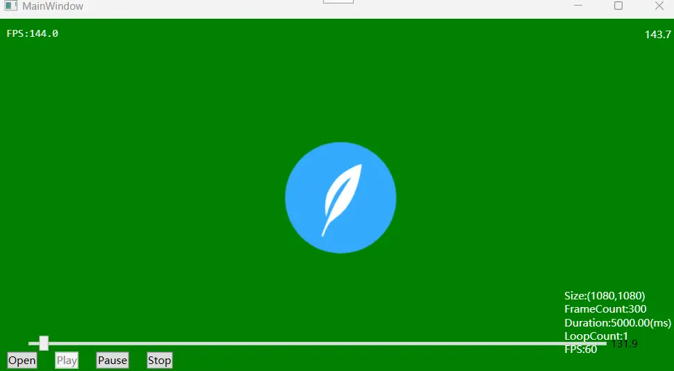
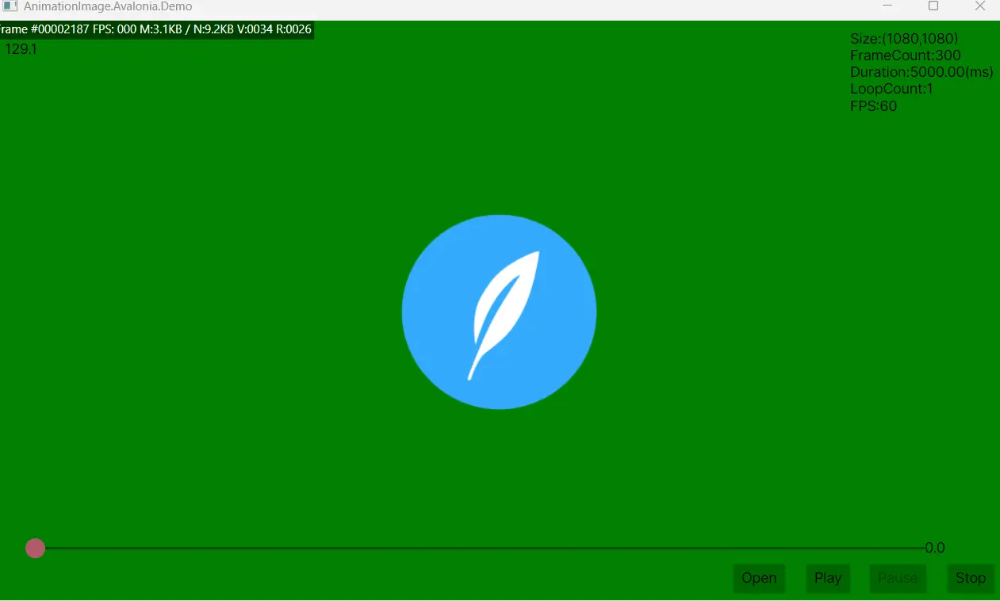
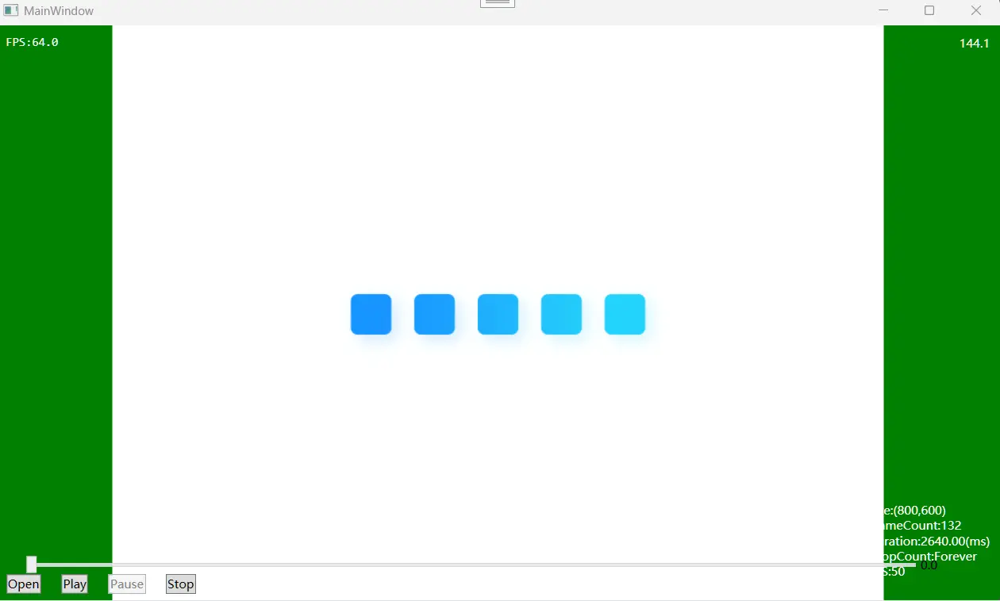
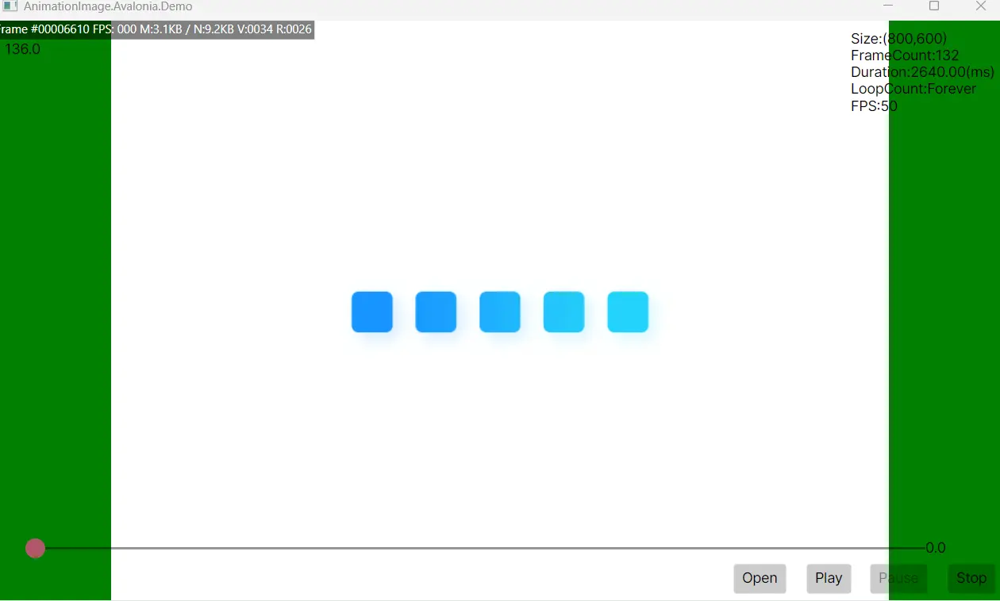

# AnimationImage

> **基于 SkiaSharp 的 WPF & AvaloniaUI 极简动图播放方案**

[](LICENSE)

## 🚀 简介

**AnimationImage** 支持播放 **Lottie(JSON)**、**GIF** 和 **WebP** 格式，相比现有方案，具有更高的帧率、更佳的渲染性能以及更低的内存占用。

### ✨ 核心特性

*   **多平台**：一套核心代码，WPF 和 AvaloniaUI 双平台原生体验。
*   **多格式**：**Lottie、GIF、WebP、APNG** 一站式支持。
*   **极致性能**：SKCodec 流式逐帧解码，内存占用极低；Lottie 基于 Skottie + GPU 加速，复杂动画丝滑流畅。
*   **智能缓存**：内存映射文件预加载，磁盘持久化、跨实例复用，大图高帧率场景也能轻松驾驭。
*   **高帧率**：框架 `Animation` 引擎驱动，告别定时器抖动；WPF 可自定义帧率，突破默认的 60FPS 至显示器刷新率。
*   **零侵入**：附加属性或标记扩展，原生 `Image` 控件即为渲染器，支持 `ImageBrush` 用于任意控件。
*   **全可控**：自动播放、循环次数、进度跳转、`Play/Pause/Stop` 命令，开箱即用。

---

性能表现：  
1、Lottie动画  
  
  

2、GIF 800x600 50FPS  
  
  

## 📦 安装

通过 NuGet 包管理器安装：

```bash
# WPF 版本
Install-Package AnimationImage.WPF

# Avalonia 版本
Install-Package AnimationImage.Avalonia
```

---

## 使用方法（参考2个Demo项目）  

引入命名空间：`xmlns:ani="https://github.com/LazyCuteLion/AnimationImage"`  

```xaml
<!-- 指定帧率为144，永久循环 -->
<Image ani:AnimatableBitmap.Source="[path]"
       ani:AnimatableBitmap.ForceFPS="144"
       ani:AnimatableBitmap.RepeatBehavior="Forever" />

<!-- 预加载全部帧画面（gif/webp有效） -->
<Image Source="{ani:AnimatableBitmap '[path]',Preload=true}" />

<!-- GPU加速解码（Lottie有效） -->
<Image Source="{ani:AnimatableBitmap '[path]',UseGPU=true}" />

<!-- 也可以用到拥有Brush类型属性的控件 -->
<Rectangle Fill="{ani:AnimatableBitmap '[path]'}" />
<Border Background="{ani:AnimatableBitmap '[path]'}" />

<!-- 取消自动播放 -->
<Image ani:AnimatableBitmap.AutoStart="False" />

<!-- 进度条 -->
<Slider Maximum="{Binding ElementName=img, Path=(ani:AnimatableBitmap.Source).Metadata.Duration}"
        Value="{Binding ElementName=img, Path=(ani:AnimatableBitmap.AnimationTime), Mode=TwoWay}" />

<!-- 命令绑定 -->
<StackPanel DataContext="{Binding ElementName=img, Path=(ani:AnimatableBitmap.Source)}"
            Orientation="Horizontal">
            <Button Command="{Binding BeginCommand, Mode=OneTime}"
                    Content="Play" />
            <Button Margin="10,0"
                    Command="{Binding PauseCommand, Mode=OneTime}"
                    Content="Pause" />
            <Button Command="{Binding StopCommand, Mode=OneTime}"
                    Content="Stop" />
</StackPanel>
```
